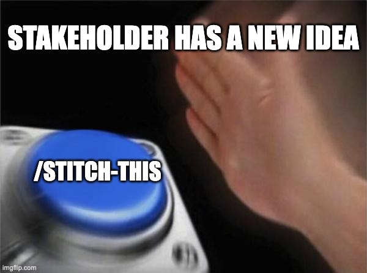

<div align="center">



# 📝 stitch-this
__"Can you help me visualise how this looks like?"__

We've heard of this before — new idea, new concepts, new iterations. Sometimes we meet creative blocks. Other times we just don't have the time (or brain juice).

_How can I generate designs cheaply and rapidly?_

Introducing `stitch-this`, a lightweight skill based on the Bento Design System, a loose list of UIs in Pandora, benchmarking that basically takes your idea, develops it just enough for you to take it to [Google Stitch](https://stitch.withgoogle.com) with the right references. 

Want it to be automated? Connect your Google Stitch MCP and it'll generate the screens for you in a new project.

</div>

## 🚀 Install


Run this script ⤵️
```bash
curl -fsSL https://raw.githubusercontent.com/andychanfp/stitch-this/main/install.sh | bash
```

Installs the skill to `~/.claude/skills/stitch-this/` and helper scripts to `~/.claude/scripts/`. Restart Claude Code after installing.

**Requirements:** Set up your [Google Stitch MCP](https://stitch.withgoogle.com/docs/mcp/setup).

## Usage

```
/stitch-this [idea]
```

Write your idea in as much detail as possible, describing interactions, what the user would expect. If not, the skill will develop your idea against it's own guidelines and principles.

The skill will also ask if you want to reinforce your idea with more input, images, and files.

## Workflow

### 1. Optimised Prompt
This will generate:

1. An optimised prompt `.md` file that you can copy and paste into Google Stitch
2. A `refs` folder with extracted UI and benchmarking screens that would help in directing Google Stitch in generation

You can then head over to your Google Stitch project and dump them all in, and hope for the best.

### 2. Generate Screens through MCP
This will generate either 1 or more screens (depending on the option you choose) through the MCP. You can head over to Google Stitch to see the screens ready for you to refine.

_Note: references are not sendable over MCP. Hence, you can add references manually later on_

## FAQ 

1. **Why not generate screens in Figma Make?** More alternatives = more avenues for you to think less when exploring designs.
2. **Will there be [insert screen name]?** Yes, over time, more screens will be added. 
3. **This hasn't considered Bento Spark yet!** Yes, it is not. The DESIGN.md file will be updated soon.
4. **Why can't it send references over MCP?** Google did not expose their API. Makes sense.
5. **The generated UI isn't that good though. It looks so different.** This will improve over time for the first-shot as the DESIGN.md file gets improved. Note that you need to work with Google Stitch to refine the direction — the first prompt will always be off.
6. **How many times should I generate?** Until you decide it's time to bring a human in.
7. **How much does it cost to generate a prompt or screen?** Not much. I've taken great pains to make sure it doesn't go over <1.5K tokens maximum per run. This happens 80-90% of the time.